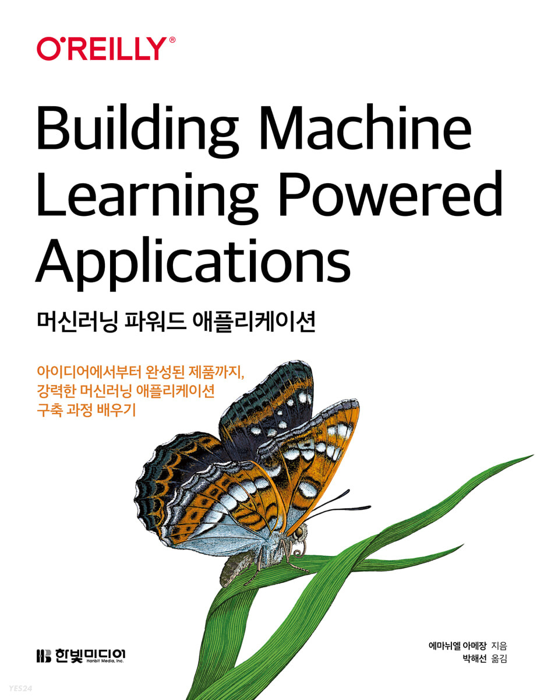
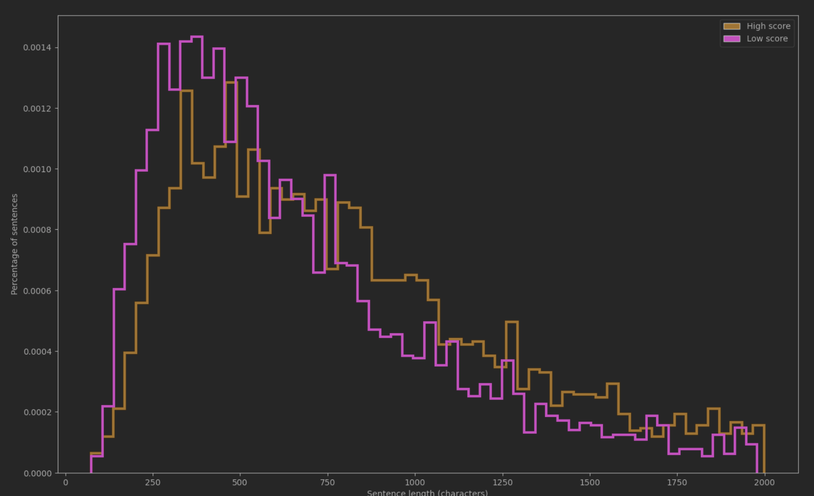

# 머신러닝 파워드 애플리케이션
{width="500" height="700"}

> git: https://github.com/rickiepark/ml-powered-applications


## 1장. 제품의 목표를 머신러닝 문제로 표현하기

어떤 문제를 해결할 것인가?
어떤 모델을 사용할 것인가?
데이터셋 구성하기

가장 간단한 모델부터 시작하기
알고리즘이 되어보기


## 2장. 계획 수립하기

성공을 측정하는 방법 정하기
간단한 파이프라인으로 시작하기

훈련 / 추론 파이프라인

## 3장. 엔드투엔드 파이프라인 만들기

머신러닝 에디터 프로토타입 만들기

최초 머신러닝 에디터 프로토타입은 모델을 사용하지 않는다
질문을 전처리하고 다양한 기준으로 평가해본다

* 전처리
	- 텍스트를 토큰화
* 품질 평가
	- 자주 사용하는 동사와 연결어의 빈도를 카운트
	- wh- 접속사를 카운트
	- 플레시 Flesch 가독성 점수를 계산


```bash
❯ python ch3.ml-editor.py "Is this workflow any good?"
단어 사용량: 0 told/said, 0 but/and, 0 wh- 접속사<br/>단어의 평균 길이 3.67, 고유한 단어의 비율 1.00<br/>6개 음절, 5개 단어, 1개 문장<br/>플레시 점수 100.26: 매우 읽기 쉬움

❯ python ch3.ml-editor.py "Here is a needlessly obscure question, that dose not provide clearly which information it would like to acquire, does it?"
단어 사용량: 0 told/said, 0 but/and, 0 wh- 접속사<br/>단어의 평균 길이 4.43, 고유한 단어의 비율 0.91<br/>30개 음절, 20개 단어, 1개 문장<br/>플레시 점수 59.65: 약간 읽기 어려움
```

반환된 정보가 너무 장황하고 관련성이 낮다
점수 대신 실행 가능한 추천을 해주는 것이 좋다

## 4장. 초기 데이터셋 준비하기

https://archive.org/details/stackexchange

> 먼저 평균 같은 기술 통계 descriptive statistics와 히스토그램을 분석해본다

* 원시 xml 파일을 csv 파일로 정형화
* 데이터 전처리
	- 데이터를 들여다보면서 칼럼이 null 인게 있는지, 그것을 사용할건지, 기본값으로 채울건지 고민
* 사용해볼 수 있는 feature
	- 질문의 upvote 수
	- 질문의 답변 수, 답변을 받았는지 여부
	- 답변이 있을때 채택된게 있는지 여부
	- 답변의 길이
		+ 높은 점수의 질문과 낮은 점수의 질문의 길이 분포를 겹쳐서 봐본다
	- 질문의 점수가 평균값보다 높은지
		+ 질문의 점수가 평균값보다 높으면 더 많은 답변을 받는 경향을 보인다
		+ 하지만 답변의 개수는 사용자가 질문을 입력하는 순간 얻을 수 있는 데이터가 아니다보니 추론시 이를 사용할 수 없다
		+ 사용하지 않거나, 상수값을 사용하는 방법 등이 있다

{width="800" height="400"}


> 데이터에 대한 직관을 조금 기른 뒤, 개별적으로 무작위로 모두 보는 것은 비효율적이니 '군집'해서 데이터를 분석해본다

* 데이터셋에 얼마나 많은 클러스터가 있나요?
* 클러스터마다 다르게 보이나요? 어떤 기준을 사용하나요?
* 다른 클러스터보다 더 조밀한 클러스터가 있나요?
* 모든 클러스터가 모델링하기 어려운 데이터를 나타내나요?

군집 알고리즘은 벡터에서 수행되기 때문에 텍스트를 벡터화할 필요가 있다


### 표 형식 특성 벡터화하기

* 범주형 데이터와 연속형 데이터
* 연속형 데이터의 경우 스케일이 큰 feature가 스케일이 작은 feature를 무시하지 않도록 일정한 스케일로 정규화 normalization 해야한다
* 범주형 데이터의 경우 one-hot 인코딩
	- 빨강 [1, 0, 0, 0], 파랑 [0, 0, 0, 1]. 거리가 모두 1
	- 경우에 따라서는 (ex. 요일) 토요일과 일요일은 주말이기에 수요일보단 가까워야 할 수도 있다

정규화 방법
```python
def get_normalized_series(df, col):
    """
    DataFrame 열을 정규화합니다.
    :param df: DataFrame
    :param col: 열 이름
    :return: Z-점수를 사용해 정규화된 시리즈 객체
    """
    return (df[col] - df[col].mean()) / df[col].std()
```

Z-Score란?
`Z = (X - μ) / σ`
* X는 특정 데이터 포인트의 값입니다.
* μ는 데이터의 평균입니다.
* σ는 데이터의 표준편차입니다.
Z-Score는 데이터 포인트가 평균에서 얼마나 떨어져 있는지를 표준편차의 단위로 표현

* Score, Comment 수를 정규화
* 날짜 특성을 year, month, day, hour로 분리
* 500개 이상 존재하는 Tag에 대해서만 추출하고 one-hot 인코딩

### 텍스트 벡터화

* BoW bag-of-words
	- 텍스트를 벡터화하는 가장 쉬운 방법은 단어의 등장 횟수를 one-hot 인코딩한 카운트 벡터를 사용하는 것
	- 전체 어휘 사전을 만들고, 각 문장들을 등장하는 단어의 여부를 나타낸 벡터로 표현하는 것
	- 이 방법은 단어의 등장 횟수는 나타내지만, 단어의 순서를 무시한다
* TF-IDF term frequency-inverse document frequency
	- TF-IDF는 모든 문서에서 자주 등장하는 단어는 중요도가 낮다고 판단하며, 특정 문서에서만 자주 등장하는 단어는 중요도가 높다고 판단합니다.
	- 전체 말뭉치와 비교하여 문서에 있는 각 단어의 상대적인 빈도를 기반으로 임베딩을 만듭니다. `sklearn`을 사용해 TF-IDF를 만듭니다.
	- `TfidfVectorizer`로 생성한 벡터는 27831 차원인데 UMAP을 통해 2차원으로 축소해서 본다
* 사전 훈련된 모델을 사용해본다면, `SpaCy` 라이브러리를 사용하여 "en_core_web_lg" 사전 훈련된 언어 모델을 로드하고, 텍스트를 벡터화한다
* 텍스트를 벡터화하고 PCA, t-SNE, UMAP 등의 기법을 통해 차원 축소를 해서 2차원에 투영하여 시각화 할 수 있다

> 분포가 비슷하면 언어적 요소가 비슷한 의미를 가진다는 분포 가설을 기반으로 동작

```python
vectorizer = TfidfVectorizer(ngram_range=(1, 2), min_df=5, max_features=2**21)
bag_of_words = vectorizer.fit_transform(raw_text)


nlp = spacy.load('en_core_web_lg', disable=["parser", "tagger", "ner", "textcat", "lemmatizer"])
train_author["vectors"] = train_author["full_text"].apply(lambda x: nlp(x).vector)
```

두가지 방식의 차이

TfidfVectorizer와 Spacy를 사용하여 텍스트 임베딩을 얻는 방법에는 몇 가지 중요한 차이점이 있습니다:

* 임베딩 방법:
	- TfidfVectorizer: TfidfVectorizer는 텍스트를 토큰화하고 TF-IDF(Term Frequency-Inverse Document Frequency) 방법을 사용하여 단어의 중요성을 계산합니다. 각 문서에서 단어의 빈도수와 전체 문서에서의 단어의 빈도수를 고려하여 각 단어에 가중치를 부여한 후, 이러한 가중치를 기반으로 문서를 임베딩합니다.
	- Spacy: Spacy는 사전 훈련된 언어 모델을 사용하여 텍스트를 벡터로 변환합니다. Spacy의 언어 모델은 단어의 의미와 관련된 정보를 포착하고, 문맥을 고려하여 단어를 벡터로 표현합니다. Spacy를 사용하면 문장, 문단 또는 문서의 벡터 표현을 얻을 수 있습니다.
* 벡터 차원:
	- TfidfVectorizer: TfidfVectorizer는 주로 희소한 벡터 표현을 사용합니다. 단어의 빈도수와 가중치로 이루어진 벡터를 생성하며, 단어의 개수에 따라 벡터의 차원이 결정됩니다.
	- Spacy: Spacy는 밀집된(dense) 벡터 표현을 사용합니다. 사전 훈련된 언어 모델은 주로 고정된 차원(예: 300차원)의 밀집 벡터를 생성합니다.
* 커버하는 언어와 기능:
	- TfidfVectorizer: TfidfVectorizer는 다양한 언어에 대해 사용할 수 있으며, 주로 단어의 빈도수를 기반으로 하는 기능을 제공합니다. 문서의 단어 빈도수에 따라 문서 간의 유사성을 계산하거나, 특정 단어의 중요도를 확인하는 데 사용됩니다.
	- Spacy: Spacy는 다양한 언어에 대한 사전 훈련된 모델을 제공합니다. 이 모델은 문장의 의미를 파악하고, 개체명 인식(Named Entity Recognition), 의존 구문 분석(Dependency Parsing) 등 다양한 언어 처리 기능을 제공합니다. 또한, Spacy의 언어 모델은 단어와 문장 수준에서의 의미 유사성을 파악하기 위한 임베딩을 제공합니다.

> 따라서, 
TfidfVectorizer는 단어의 빈도수와 가중치를 기반으로 한 희소한 벡터 표현을 생성하며, 
Spacy는 사전 훈련된 언어 모델을 사용하여 단어와 문장의 의미를 파악한 밀집 벡터 표현을 생성합니다. 
선택하는 방법은 사용 목적과 데이터에 따라 다를 수 있으며, 어떤 유형의 텍스트 임베딩이 필요한지에 따라 적절한 방법을 선택해야 합니다.


### 이미지 벡터화

> .h5 Hierarchical Data Format(HDF)
> .h5 파일은 특히 데이터 과학 및 기계 학습 분야에서 널리 사용되는 파일 형식 중 하나입니다. 주로 모델 가중치(weights)나 구조, 훈련된 모델, 배열, 행렬 등의 다양한 형태의 데이터를 저장하기 위해 사용됩니다.

사전훈련된 VGG16 모델을 사용해서 image를 벡터화

```python
def generate_features(image_paths):
    """
    이미지 경로의 배열을 받아 사전 훈련된 신경망을 사용해 추출한 특성을 반환합니다.
    :param image_paths:
    :return:
    """
    images = np.zeros(shape=(len(image_paths), 224, 224, 3))

    pretrained_vgg16 = VGG16(weights="imagenet", include_top=True)

    # 학습된 특성을 위해 마지막에서 두 번째 층만 사용합니다.
    model = Model(inputs=pretrained_vgg16.input,
                  outputs=pretrained_vgg16.get_layer('fc2').output)

    # 데이터셋을 모두 메모리에 적재
    for i, f in enumerate(image_paths):
        img = image.load_img(f, target_size=(224, 224))
        x_raw = image.img_to_array(img)
        x_expand = np.expand_dims(x_raw, axis=0)
        # i번째 element로 row, column, channel 데이터를 모두 x_expand로 채우는 과정
        images[i, :, :, :] = x_expand

    # 이미지를 모두 적재한 후에 모델에 통과시킵니다
    inputs = preprocess_input(images)
    images_features = model.predict(inputs)
    return images_features
```

### 군집

차원 축소와 비슷하게 문제를 드러내고, 데이터 포인트를 찾기 위해 군집을 사용합니다.


* 최적의 클러스터 수 찾기 문제
	- 이너셔
		+ 각 샘플과 가장 가까운 센트로이드 사이의 평균 제곱 거리이며 모델의 이너셔 inertia 라고 한다
	- 실루엣 점수
		+ 모든 샘플에 대한 '실루엣 계수'의 평균

실루엣 점수 silhouette score

모든 샘플에 대한 '실루엣 계수'의 평균
실루엣 계수 = (b-a) / max(a,b)
a: 동일한 클러스터에 있는 다른 샘플까지 평균 거리 (클러스터 내부의 평균 거리)
b: 가장 가까운 클러스터까지 평균 거리 (가장 가까운 클러스터의 샘플까지 평균 거리)

+1 에 가까우면 자신의 클러스터 안에 잘 속해 있고, 다른 클러스터와는 멀리 떨어졌다는 뜻
-1 에 가까우면 이 샘플이 잘못된 클러스터에 할당 되었다는 의미


여기서는 클러스터 개수 2,3,4,5개의 경우를 시각화해서 보지만 딱히 최적의 클러스터 수가 찾아지진 않는다


### 데이터를 활용한 특성 생성과 모델링

필요하다면 feature를 추가적으로 생성할 수 있습니다.

* 모델은 날짜 데이터를 해석하는데 어려움이 있습니다.
	- 가장 간단하게는 날짜를 unix time으로 변경하는 방법
	- 요일과 일자를 추출하기
	- 월초주말, 월말주중 같은 특성을 만들기 위해 '요일 * 일자'라는 교차 특성 추가
	- 'is_last_two_weekends'라는 이진 특성 추가
* 머신러닝 에디터의 경우
	- can, should 같은 action verb가 있는지에 대한 이진 특성 추가
	- 물음표가 있는지
	- 영어와 관련된 질문인지 (올바른 영어 사용에 대한 질문은 답변을 받지 못하는 경향이 있으니)
	- 매우 짧은 질문인지 (텍스트의 길이를 정규화해서 표현)
	- 제목에 중요한 정보가 포함되어 있는지. 제목을 텍스트에 포함시킨다


feature를 추가하여 다시 embedding을 생성하고 2차원으로 차원 축소하여 시각화해봅니다


## 5장. 모델 훈련과 평가

어떤 모델을 선택해야할까?

* 간단한 모델
	- 빠른 구현
	- 쉬운 이해
	- 배포 가능
* 데이터의 패턴과 feature를 기준으로 선정하기
	- 특성 스케일이 많이 차이나는지?
		+ 신경망 같은 경사 하강법 최적화를 사용하는 모델은 특성 스케일이 다르면 훈련이 불안정해짐
		+ ex. 나이와 수입
	- 타깃이 특성의 선형 조합입니다
	- 데이터에 시계열 특징이 있습니다
	- 각 샘플이 패턴의 조합입니다


### 랜덤 포레스트 모델 훈련시키기

머신러닝 에디터 모델을 랜덤 포레스트 분류기로 시작해봅니다


데이터를 훈련 세트와 검증 세트로 나누어야 합니다
모델을 여러번 반복해 검증 세트에서 성능을 측정하기 때문에, 모델이 검증 세트에서 잘 동작하도록 편향될 수 있습니다
따라서 모델의 반복 튜닝이 끝나면 본 적 없는 데이터(테스트 세트)로 최종 성능을 평가합니다

테스트 세트는 실전에 투입했을 때 본 적 없는 데이터를 대표합니다. 따라서 일부 사용자에 대한 성능만을 나타내는 것일 수 있습니다
훈련 세트는 제품의 모든 사용자가 만드는 데이터와 비슷해야 합니다. 대표성이 높은 데이터셋을 추가하는 것은 좋습니다

보통은 훈련:검증:테스트 = 70:20:10

* 데이터 누수 (랜덤하게 데이터를 나누었을때 발생)
	- 시계열 데이터 누수
	- 샘플 오염 (데이터 중복)


머신러닝 에디터 데이터를 랜덤으로 분할할때 주의해야 할 점은? 작성자

인기가 높은 작성자는 답변이 달릴 확률이 높고, 그 고유한 스타일을 모델이 overfitting 하게될 수 있다
그렇게 되면 동일한 작성자에 대한 검증이 높은 정확도를 내게 된다

이를 피하기 위해 각 작성자는 훈련, 검증 둘 중 하나에만 나타나야 한다
사이킷런의 `GroupShuffleSplit`을 사용한다

> 데이터를 다룰때 vstack, hstack을 유용하게 잘 쓰면 좋을듯


* 정밀도(precision):
	- 정밀도는 양성 클래스로 예측한 샘플 중 실제 양성인 샘플의 비율. 
	- 가짜 양성(FP)을 최소화하는 것에 중점을 둡니다.
* 재현율(recall):
	-  재현율은 실제 양성인 샘플 중에서 모델이 정확히 양성으로 예측한 샘플의 비율. 
	-  누락된 실제 양성(TN)을 최소화하는 것에 중점을 둡니다.
* F1 점수:
	- F1 점수는 정밀도와 재현율의 조화 평균입니다. 정밀도와 재현율의 균형을 나타내는 지표입니다.
* 정확도(accuracy):
	- 정확도는 전체 샘플 중에서 올바르게 분류된 샘플의 비율을 나타냅니다.

> 임베딩 모델이랑 랜덤 포레스트 모델을 둘다 학습시켜서 사용한다


편향-분산 트레이드오프

* 편향(Bias):
	- 편향은 모델이 주어진 학습 데이터에서 얼마나 정확한 예측을 수행할 수 있는지를 나타냅니다.
	- 편향이 큰 모델은 데이터의 패턴을 충분히 학습하지 못하고, 너무 간단하거나 제약이 많은 모델일 수 있습니다.
	- 편향이 큰 모델은 학습 데이터와 테스트 데이터 모두에서 성능이 낮을 수 있으며, 이는 과소적합의 특징입니다.
* 분산(Variance):
	- 분산은 모델이 학습 데이터에 대해 얼마나 민감하게 반응하는지를 나타냅니다.
	- 분산이 큰 모델은 학습 데이터에 대해 과도하게 적합되어 있는 경향이 있습니다.
	- 분산이 큰 모델은 학습 데이터에서는 좋은 성능을 보이지만, 새로운 데이터에 대해서는 예측 불안정성이 높아져서 테스트 데이터에서 성능이 낮아질 수 있습니다. 이는 과대적합의 특징입니다.

편향과 분산은 서로 상충하는 개념으로, 모델의 복잡성과 관련이 있습니다. 일반적으로, 복잡한 모델은 학습 데이터에 대해 높은 분산을 가지지만 편향이 낮을 수 있습니다. 반면에, 단순한 모델은 학습 데이터에 대해 낮은 분산을 가지지만 편향이 높을 수 있습니다.


하나의 성능 지표만을 사용하는 것은 신뢰성이 떨어진다


* 오차행렬
* ROC 곡선
	- FPR, TPR
* 보정 곡선
* 오차를 위한 차원 축소
	- 오차가 밀집된 영역을 찾는 것
	- 오차의 트렌드를 보기위해 데이터 포인트에 색을 입힘
* top-k 방법
	- 최상의 k개 샘플
	- 최악의 k개 샘플
	- 가장 불확실한 k개 샘플
		+ ex. 고양이와 강아지가 모두 들어있는 사진
	- 을 선정하여 샘플을 구별해본다
	- 각 샘플 별로 공통된 특성을 찾아본다


feature 중요도 평가
`clf.feature_importances_` 사용해서 feature들의 중요도를 볼 수 있다


랜덤 포레스트 모델의 경우 사이킷런에서 제공되기도하고, feature 중요도를 쉽게 추출할 수 있었지만,
인공 신경망 같은 모델의 경우 feature 중요도를 얻기가 쉽지 않다
이럴때 사용할 수 있는 블랙박스 모델 설명도구가 있으면 좋다
여기서는 lime을 사용한다


## 6장. 머신러닝 문제 디버깅

머신러닝 소프트웨어 개발은 반복이다
일반적인 소프트웨어와 머신러닝 소프트웨어가 다른 점은, 정상적으로 출력을 내는데 성공해도 그 예측이 정확하다는 보장을 할 수 없다는 것

디버깅 방법 (점진적)
* 데이터 흐름
* 훈련 능력
* 일반화
* 추론

### 데이터 흐름

* 하나의 샘플로 시작하기
* 시각화 단계
* 데이터 로딩 (EDA와 비슷하게)
	- 모든 특성이 채워져있나요?
	- null, 상수 값이 채워져 있나요?
	- 범위가 올바른가요?
* 정제와 특성 선택 (feature selection)
* 특성 생성
* 데이터 포맷 변경
* 모델 출력
	- 출력 결과물을 레이블과 비교, 확인
* 시각적인 검증 자동화하기
* 관심 사항 분리하기
* 머신러닝 코드 테스트
	- 데이터 주입 테스트
	- 데이터 처리 테스트
	- 모델 출력 테스트

### 훈련 디버깅: 모델 학습하기

* 모델의 성능 측정
	- 훈련 세트의 수를 점진적으로 늘려본다
	- 받아들일 수 있는 오차 수준을 측정
* 모델의 성능이 낮다면?
	- 작업이 너무 어려운게 아닐까
		+ 보유한 데이터의 양과 다양성
		+ 생성된 특성의 유용성
		+ 모델의 복잡도
* 최적화
	- 하이퍼파라미터 선택
	- loss(손실) 그래프
		+ loss curve가 매우 느리게 감소한다면 모델이 너무 느리게 학습한다는 것을 의미
	- 가중치와 활성화값의 변화를 시각화해서 본다

### 일반화 디버깅: 유용한 모델 만들기

결국 머신러닝 프로젝트의 목표는 '이전에 본적없는 데이터에서도 잘 동작하는 머신러닝 모델을 만드는 것'

훈련, 검증, 테스트 세트

* 데이터 누수
	- 검증 성능이 훈련 성능보다 높으면 데이터 누수가 원인일 수 있다
	- 훈련 세트에 있는 샘플이 검증 세트에 있는 샘플 내용을 담고 있다면, 검증 성능이 올라갈 수 있다
* 과대적합
	- 편향-분산 트레이드오프
		+ 편향이 큰 모델 -> 과소적합 (둔감)
		+ 분산이 큰 모델 -> 과대적합 (예민)
	- 테스트 세트보다 훈련 세트 성능이 너무 높다면 과대적합
	- 과대적합을 막으려면? 규제
		+ 관련없는 많은 패턴에 초점을 맞추는 모델의 능력을 제한, 적은 개수의 더 유용한 특성을 사용하게 만드는 것
		+ L1규제
			* 유용하지 않은 특성을 0으로 만듬
		+ L2규제
		+ dropout (신경망)
			* 훈련 과정에서 신경망의 뉴런 중 일정 비율을 랜덤하게 무시
			* 하나의 뉴런이 과도하게 영향력을 발휘하지 못하도록 함
		+ 트리의 최대 깊이 줄이기 (트리 기반 모델. 랜덤 포레스트)
		+ 데이터 증식
			* 과대적합되기 힘든 데이터를 만드는 것
			* 이미지 색조 변경, 회전, 절단
	- 이렇게해도 성능이 낮다면? 데이터셋 재설계
		+ 훈련 세트가 전체 데이터셋을 잘 대표하도록 분할
		+ k-폴드 교차 검증
			* 훈련 데이터를 k개의 폴드로 분할하고 차례대로 한 폴드씩 검증 세트의 역할을 담당하면서 모델의 성능을 측정합니다
* 문제 다시 생각하기


